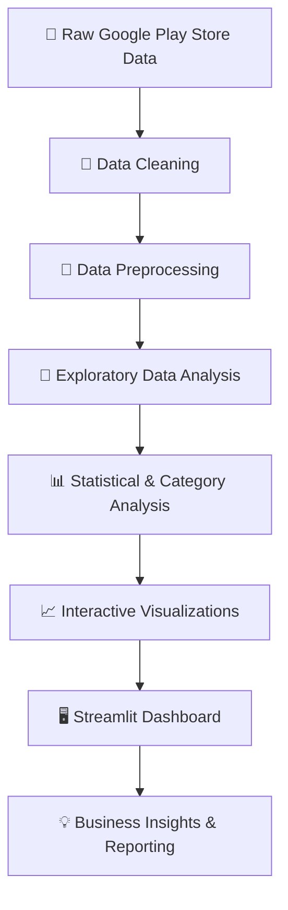

# 📊 Google Play Store Analytics Dashboard

<<<<<<< HEAD
<div align="center">
=======
> **An Interactive Data Analytics & Business Intelligence Dashboard built using Python, Streamlit, Plotly, and optional Power BI.**
>>>>>>> b8988f2 (Finalize Google Play Store Analytics Insights Dashboard)


**An interactive data analytics and business intelligence project built with Python, Streamlit, and Plotly.**

[](https://www.python.org/)
[](https://streamlit.io/)
[](https://pandas.pydata.org/)
[](https://plotly.com/)
[](https://powerbi.microsoft.com/)

[**🚀 Live Dashboard**](https://app-play-store-analytics-dashboard-pmmyeqzcgbnuutsuxyihxb.streamlit.app/) • [**💻 GitHub Repository**](https://github.com/shamsiyakp030-oss/Google-Play-Store-Analytics-Dashboard)

</div>

---

## 🌟 Project Overview

The **Google Play Store Analytics Dashboard** is an interactive data analytics project developed as part of the Google Play Store Data Analytics Internship.

<<<<<<< HEAD
The project transforms raw application data into meaningful business insights through data cleaning, exploratory data analysis, statistical analysis, and interactive visualizations.
=======
The project demonstrates the complete analytics workflow—from data cleaning and preprocessing to interactive dashboard development and business insight generation. Using Python, Streamlit, Plotly, and optional Power BI, the application enables users to explore application performance through dynamic visualizations and filters.
>>>>>>> b8988f2 (Finalize Google Play Store Analytics Insights Dashboard)

Built with **Python, Streamlit, Pandas, NumPy, and Plotly**, the dashboard helps users explore app performance, compare application categories, understand rating distributions, and investigate market trends through interactive analytics.

The project demonstrates practical skills in data analytics, business intelligence, data visualization, and dashboard development.

---

## 🎯 Project Objectives

* 🧹 Clean, transform, and preprocess raw Google Play Store data.
* 🔎 Perform exploratory data analysis (EDA).
* 📊 Develop interactive dashboards for application performance analysis.
* 📈 Visualize app ratings, installs, reviews, and category distributions.
* 💡 Discover patterns and generate data-driven business insights.
* 🖥️ Build an accessible analytics application using Streamlit.
* 📑 Present analytical findings through clear visualizations and reporting.

---

## ✨ Key Features

<table>
<tr>
<td width="50%">

### 📊 Interactive Analytics

* Dynamic filters and selections
* Interactive Plotly charts
* KPI summaries
* Category-level comparisons
* Data exploration

</td>
<td width="50%">

### 📈 Business Intelligence

* App performance analysis
* Rating and review patterns
* Install distribution
* Market comparisons
* Trend exploration

</td>
</tr>
<tr>
<td width="50%">

### 🧹 Data Processing

* Missing-value handling
* Duplicate detection
* Data cleaning
* Feature transformation
* Statistical summaries

</td>
<td width="50%">

### 🎨 Dashboard Experience

* Multi-page dashboard
* Interactive chart controls
* Dark-themed visual design
* Data-focused presentation
* Download-ready analysis where supported

</td>
</tr>
</table>

---

## 📊 Dashboard Modules

| Module                | Description                                        | Visualizations                        |
| --------------------- | -------------------------------------------------- | ------------------------------------- |
| 🏠 Executive Overview | High-level application performance and key metrics | KPI cards, category summaries         |
| 🌞 Sunburst Analysis  | Explore category and application distributions     | Interactive sunburst chart            |
| 🗓️ Calendar Heatmap  | Examine time-based patterns and growth             | Calendar heatmap, trend analysis      |
| 🌊 Streamgraph        | Compare category trends over time                  | Interactive streamgraph               |
| 🔥 Cluster Heatmap    | Explore patterns among grouped applications        | Clustering and heatmap visualizations |
| 🎯 Radar Chart        | Compare multiple performance dimensions            | Interactive radar chart               |
| 🔵 Hexbin Density     | Investigate relationships and dense data regions   | Hexbin and density analysis           |

---

## 🛠️ Technology Stack

| Area                          | Tools                                |
| ----------------------------- | ------------------------------------ |
| Programming Language          | Python                               |
| Web Application               | Streamlit                            |
| Data Manipulation             | Pandas, NumPy                        |
| Data Visualization            | Plotly, Matplotlib                   |
| Machine Learning / Clustering | Scikit-learn                         |
| Business Intelligence         | Microsoft Power BI, where applicable |
| Spreadsheet Processing        | OpenPyXL                             |
| Development Environment       | Visual Studio Code                   |
| Version Control               | Git, GitHub                          |

---

## 🧠 Analytics Workflow



---

## 📁 Project Structure

```text
Google-Play-Store-Analytics-Dashboard/
│
├── app.py
├── requirements.txt
├── README.md
├── google_logo.svg
│
├── data/
│   └── googleplaystore.csv
│
├── pages/
│   ├── 1_Hexbin_Density.py
│   ├── 2_Sunburst.py
│   ├── 3_Calendar_Heatmap.py
│   ├── 4_Streamgraph.py
│   ├── 5_Cluster_Heatmap.py
│   └── 6_Radar_Chart.py
│
├── utils/
│   ├── cleaning.py
│   └── time_control.py
│
├── reports/
│   └── Internship_Report.pdf
│
└── screenshots/
    ├── overview.png
    ├── sunburst.png
    ├── calendar_heatmap.png
    └── cluster_heatmap.png
```

*Note: This is a representative structure. Update the tree to match the exact files and folders in your current repository.*

---

## 🚀 Getting Started

### 1. Clone the repository

```bash
git clone https://github.com/shamsiyakp030-oss/Google-Play-Store-Analytics-Dashboard.git
```

### 2. Navigate to the project directory

```bash
cd Google-Play-Store-Analytics-Dashboard
```

If your Streamlit application is inside the nested `Google_Play_Analytics_Internship_Project` directory, navigate into that folder before continuing.

### 3. Create a virtual environment

```bash
python -m venv venv
```

**Windows PowerShell:**

```powershell
.\venv\Scripts\Activate.ps1
```

### 4. Install dependencies

```bash
python -m pip install -r requirements.txt
```

### 5. Launch the application

```bash
python -m streamlit run app.py
```

The dashboard will be available in your browser at the local Streamlit address, typically `http://localhost:8501`.

---

## 💡 Business Insights

The dashboard supports exploration of questions such as:

* Which app categories have the highest number of applications?
* How are app ratings distributed across categories?
* What patterns exist between reviews and installs?
* How do application sizes relate to ratings?
* Which categories show different installation patterns?
* What trends can be explored through update dates and category-level analysis?

These analyses can help users understand application performance and investigate potential market opportunities. Findings depend on the selected data and filters.

---

## 📚 Learning Outcomes

This project provided practical experience in:

* Data cleaning and preprocessing
* Exploratory data analysis
* Data visualization and interpretation
* Interactive dashboard development
* Python-based analytics
* Business intelligence concepts
* Data storytelling
* Multi-page Streamlit application development
* Git and GitHub workflow
* Analytical reporting and documentation

---

## 🔮 Future Enhancements

* 🤖 Machine learning-based install prediction
* 💬 User review sentiment analysis
* 🔄 Integration with live or regularly updated app data
* 🎯 Application recommendation system
* 📤 PDF and Excel report exports
* 🔐 User authentication and personalized dashboards
* ⚡ Performance optimization for larger datasets
* 🌗 Additional theme and accessibility options

---

## 🖼️ Dashboard Screenshots

Add screenshots from your running application to the `screenshots/` directory and update the image paths below.

| Dashboard          | Preview                            |
| ------------------ | ---------------------------------- |
| Executive Overview | `screenshots/overview.png`         |
| Sunburst Analysis  | `screenshots/sunburst.png`         |
| Calendar Heatmap   | `screenshots/calendar_heatmap.png` |
| Streamgraph        | `screenshots/streamgraph.png`      |
| Cluster Heatmap    | `screenshots/cluster_heatmap.png`  |
| Radar Chart        | `screenshots/radar_chart.png`      |

---

## 👩‍💻 About the Author

<div align="center">

### **Shamsiya K P**

**AI & Data Science Graduate | Aspiring Data Analyst | Data Science Enthusiast**

Interested in transforming data into meaningful insights through analytics, visualization, and machine learning.

[](https://github.com/shamsiyakp030-oss)
[](https://www.linkedin.com/in/shamsiya-kp/)

</div>

### Technical Skills

`Python` `SQL` `Pandas` `NumPy` `Streamlit` `Plotly` `Power BI` `Excel` `Machine Learning` `Data Analytics` `Data Visualization`

---

## 🙏 Acknowledgements

This project was developed as part of the **Google Play Store Data Analytics Internship**, providing an opportunity to apply data analytics techniques, build interactive visualizations, and explore business intelligence concepts using real-world application data.

---

## 📄 License

This project is intended for educational, portfolio, and internship evaluation purposes. Review the dataset's original license and usage terms before redistributing the data.

---

<<<<<<< HEAD
<div align="center">

**⭐ If you find this project interesting, feel free to explore the repository and the live dashboard.**


</div>
=======
⭐ If you found this project helpful, consider giving it a star on GitHub.

## Final Project Structure

- `app.py` — Streamlit landing/dashboard page
- `pages/` — six analytics modules
- `utils/` — shared cleaning, filters, and IST access control
- `data/googleplaystore.csv` — primary Google Play dataset
- `data/googleplaystore (2).csv` — enriched dataset used by the calendar heatmap (sentiment fields included)
- `data/googleplaystore_with_country.csv` — dataset variant containing the Country field
- `requirements.txt` — deployment dependencies

### Deployment

Run locally with:

```bash
streamlit run app.py
```

The dashboard pages intentionally use separate IST access windows as specified by the internship project requirements.

The Sunburst page labels the country hierarchy as **Global** when the selected dataset has no genuine country field; it does not fabricate country-level results.
>>>>>>> b8988f2 (Finalize Google Play Store Analytics Insights Dashboard)
